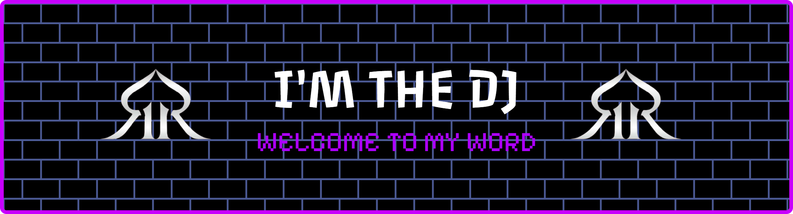

  

## 👨‍💻 About Me

🚀 Full-Stack Developer | Software Engineering Student @ ISET Charguia | Brand Owner **R2R_tn**  
☁️ Oracle Cloud AI Certified | Former Professional Forex Trader  

🔭 Currently working on: **Marchify** (multi-vendor marketplace) & **R2R_tn** e‑commerce  
🌱 Currently learning: advanced cybersecurity, DevOps & scalable architectures  

## 🛠️ Tech Stack

### 👨‍💻 Languages

### 🧩 Backend Frameworks

### 🎨 Frontend & UI

### 🗄️ Databases & ORM

### ☁️ DevOps & Cloud

### 🤖 AI & Data

### 🐧 Linux Administration

### 🔒 Cybersecurity

### ☁️ Cloud & DevOps

### 🏆 Certifications

## 🚀 Projects

- **Marchify** – Multi-vendor marketplace for local commerce (clients, vendors, delivery)
- **R2R_tn** – E-commerce platform for my clothing brand “Reborn to Rise”
- **MagriPlast B2B** – B2B order management and communication platform
- **Blockchain Trading Simulator** – SOA-based simulated trading using blockchain

## 📫 Connect with Me

